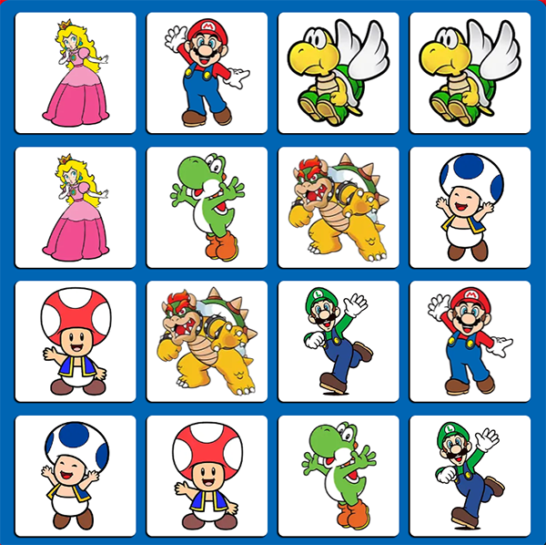
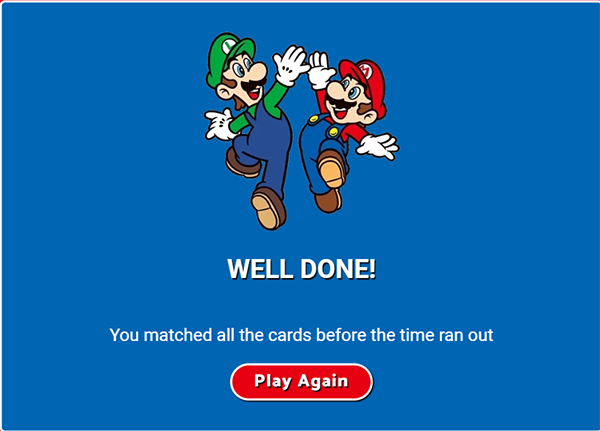
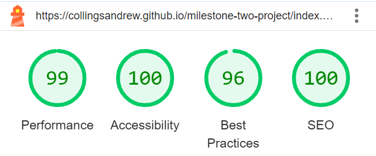

# Mario Memory

This is the website for Mario Memory; it is designed to be visually appealing, user-friendly, interactive, and accessible on all devices. It consists of a memory game that is themed around Mario.

[View live webpage](https://collingsandrew.github.io/milestone-two-project/index.html)

---

## User Experience (UX)

### Site Contents

- A Mario themed memory game.
- Instructions on how to play the game.
- A form that allows the user to contact the site owner.

### Target Audience

- Children.
- Young teenagers.
- Anyone with an interest in Mario.

### Project Purpose

The purpose of this project is to provide the user with a website on which they can take part in a fun memory game. It must have good design principles and provide significant interactive functionality.

### User Stories

#### Client Goals

1. I want the site to be simple to navigate and use.
2. I want to give the user a means of contacting the site owner.
3. I want the game to be intuitive and easy to understand, so that users of all ages can enjoy it.
4. I want the site to be accessible on multiple platforms (such as web, mobile, and tablets), so that users can play it on their preferred devices.
5. I want the site to have a visually appealing interface with good design principles and high-quality images, so that it attracts and engages users from the moment they visit.

#### User Goals

6. I want to take part in a fun game.
7. I want to read the instructions for the game.
8. I want to see how many cards I have matched so far.
9. I want to easily play again once the game is finished.
10. I want to see the game board with all the cards facing down initially so that I can begin the game.
11. I want to flip two cards at a time to match pairs so that I can progress through the game.
12. I want the cards to flip back if they don't match, so that I can try again.
13. I want the cards to stay flipped if they match.
14. I want the cards to be in a different position each game.
15. I want a timer to challenge myself to complete the game in the given time.
16. I want the option to restart the game.
17. I want visually appealing card designs and animations, so that the game is enjoyable to play.

## Accessibility

The site has been built with accessibility in mind to ensure that it is always a positive experience.

This has been achieved by:
- Semantic HTML.
- Choosing fonts and colours with high contrast.
- Adequate aria-labels for interactive features.
- Adequate alt attributes for images.

## Design

### Design Choices

The site has been designed to be consistent with the Mario theme; all images, colours and design choices have been made to make the user feel immersed in the world of Mario.

All images in this project were sourced from [ClipartMax](https://www.clipartmax.com/).

### Wireframes

Game Page

Modals

Contact Modal

404 Page

### Typography

The following Google Fonts were used on this site:

- Catamaran is used for the headings on the site.

- Roboto is used for the main text of the site.

Both of these fonts have been sourced from the [Official Mario Website](https://mario.nintendo.com/) to maintain a consistent theme.

### Colour Scheme

The color scheme across the site has been chosen to maintain a consistent theme. The red colour choice, inspired by the [Official Mario Website](https://mario.nintendo.com/), ensures coherence with the franchise. Likewise, the blue color has been matched to Mario's iconic apron, maintaining the consistent theme. These colours provide good contrast when placed together.

Red

Blue

## Features

- The site boasts a responsive design, ensuring accessibility across all device sizes.
- All images are of high quality and are chosen to align with the theme of the site.
- The design is simple, providing an immediate understanding of the site's purpose and the essence of the game.
- The site consists of a single page, making it easy to navigate and simple to use.

User Stories: 1, 3, 4, 5, 17

### Page Heading

- The moment the user enters the site, they are greeted by an image of Mario alongside the heading 'Mario Memory'.

User stories: 5

Preview

### Game Stats

- Displays a visible indicator showing the number of correct matches the user has made, allowing them to track their progress.
- Displays the remaining time until the end of the game, ensuring players can keep track of their progress.

User stories: 8, 15

Preview

### Game Board

- The game board consists of 16 cards, all with appealing designs adhering to the consistent theme.
- The cards are shuffled at the start of each game.
- The user can only flip two cards at a time.
- Unmatched cards are flipped back over.
- When two cards are matched, the cards remain flipped.
- High quality Mario themed images have been used for the card designs.

User stories: 5, 6, 10, 11, 12, 13, 16, 17

Preview Unflipped

Preview Flipped

### New Game

- Allows the user to start a new game.
- Shuffles the cards each time the 'New Game' button is clicked.

User Stories: 9, 14, 16

### How To Play Modal

- Displays a modal upon clicking the 'How To Play' button.
- Provides the user with the goal of the game and instructions on how to play.
- Close button that hides the modal.

User Stories: 3, 7

Preview

### Contact Us Modal

- Displays a modal upon clicking the 'Contact Us' button.
- Offers the user a form to complete, enabling communication with the site owner.
- Utilizes the emailjs API for transmitting completed forms to the site owner.
- Close button that hides the modal.

User Stories: 2

Preview

### Modals

- All modals follow the same consistent design and use high quality images.
- Alerts the user whether they have completed the game or that it is game over.
- Offers the user the option to play again.
- All cards shuffle when the user chooses to play again.

User Stories: 5, 9, 14, 16

Winning Modal

Game Over Modal

## Deployment

### Deploying the project

GitHub pages were used to deploy this project. The following steps explain how this is done:

1. When logged into GitHub, locate and access the [repository.](https://github.com/collingsandrew/milestone-two-project)
2. Click on the settings link that is located at the top of the repository.
3. Using the menu to the left, follow the pages link.
4. Here, we then need to make sure the source drop-down box is set to 'deploy from branch'.
5. Finally, we set the branch to 'main' and the folder to 'root', and then click save.

The page should then refresh, and the link to the deployed website should appear at the top of the page.

### Fork

Forking a project creates a completely separate codebase and allows a user to make local changes to a project without affecting the original repository itself.

To fork the repository:

1. When logged into GitHub, locate and access the [repository.](https://github.com/collingsandrew/milestone-two-project)
2. At the top right of the repository, there will be a 'fork' option.

### Clone

Cloning a project allows a user to make contributions to the main repository, with permission.

To clone the repository:

1. When logged into GitHub, locate and access the [repository.](https://github.com/collingsandrew/milestone-two-project)
2. Above your files to the right, select the code drop down button and select either HTTPS, SSH or GitHub CLI and then copy the URL below.
3. Then, in your chosen code editor, change the current working directory to the location you would like the cloned repository to be located.
4. In the terminal, type 'git clone' and paste the URL that you copied earlier, and then press enter.

## Testing

Testing was conducted continuously throughout the entire project development process. Google Developer Tools and [JSHint](https://jshint.com/) were utilized to identify errors and troubleshoot any issues that arose during development.

Automated testing helps catch problems quickly and saves time by letting the computer do repetitive tasks instead of the developer. For example, if a change is made to a project, automated testing can be used to check to make sure that everything is working as it should be and all code is free from errors.

When automated testing would be deployed;
- When the developer needs to test things over and over again.
- To make sure changes do not break existing stuff.
- When there is a lot of code to test.
- To check how different parts of the software work together.
- To see how well the software handles lots of users.
- To test the performance of the software.
- To automatically test new code before it is deployed.

Automated testing benefits;
- Saves time.
- Is reliable.
- Always gives an accurate result.
- Works for both small and large projects.
- Can isolate any errors to help identify where a problem is occurring.

Manual testing involves understanding what the software should do, planning how to test it, thoroughly trying out all its features, making sure others can repeat your tests, documenting what you find, being careful and attentive to details, testing for unexpected issues, and continuously learning and improving your testing practices.

When manual testing would be deployed;
- When the developer needs to check things by hand.
- To try and find unexpected problems.
- To see if a user would find the software easy to use.
- When the developer needs to quickly check something instead of doing automated tests.
- Before deployment to double check everything is working as it should.

Manual testing benefits;
- The developer knows what the code should do.
- The developer can test everything carefully.
- The tests can be done by multiple testers.
- The findings of tests can be written down and passed on.
- Allows for discussions to correct errors.
- Allows for user simulation.
- Allows the developer to learn from mistakes made.

### Code Validation

#### HTML Validation

[W3C Markup Validation Service](https://validator.w3.org/) was used to validate the HTML. No errors were found.

[Page Results](https://validator.w3.org/nu/?doc=https%3A%2F%2Fcollingsandrew.github.io%2Fmilestone-two-project%2Findex.html)

#### CSS Validation

[W3C CSS Validation Service](https://jigsaw.w3.org/css-validator/) was used to validate the CSS. No errors were found.

[Page Results](https://jigsaw.w3.org/css-validator/validator?uri=https%3A%2F%2Fcollingsandrew.github.io%2Fmilestone-two-project%2Findex.html&profile=css3svg&usermedium=all&warning=1&vextwarning=&lang=en)

#### JavaScript Validation

[JSHint](https://jshint.com/) was used to validate the Javascript files. No issues were found. One undefined variable found in sendEmail.js, this is code used for the emailjs API which is initialized within the index.html head tag.

script.js

sendEmail.js

### Accessibility Testing

[WAVE Web Accessibility Tool](https://wave.webaim.org/) was used to test for accessibility errors. The page passed with no errors and no contrast errors.

[Page Results](https://wave.webaim.org/report#/https://collingsandrew.github.io/milestone-two-project/index.html)

### Lighthouse Testing

Google Lighthouse was used to test the page. The page performed well.

Mobile

Desktop

### Testing User Stories

1. I want the site to be simple to navigate and use.
    * The site consists of one page with everything it provides.
    * The site has a simple structure, making it easy to navigate.
    * The site contains only necessary content.
    * The structure remains the same on all device sizes.
    * The controls on the site clearly indicate what they are for.
    * The site follows good accessibility principles.

2. I want to give the user a means of contacting the site owner.
    * The site offers users a contact form through which they can send messages to the site owner.

3. I want the game to be intuitive and easy to understand, so that users of all ages can enjoy it.
    * The game consists of clear, high-quality images in a simple design to keep the user's attention.
    * The game avoids being too complex to suit the target audience.
    * Upon first impressions, the user will immediately recognise the aim of the game.
    * Simple controls; just click/touch and play.
    * Simple, straight-forward instructions are provided.

4. I want the site to be accessible on multiple platforms (such as web, mobile, and tablets), so that users can play it on their preferred devices.
    * The site has been designed with a mobile first approach.
    * The site is responsive on all device sizes.

5. I want the site to have a visually appealing interface with good design principles and high-quality images, so that it attracts and engages users from the moment they visit.
    * The site follows a consistent design.
    * The colours used are in good contrast and follow the theme of the site.
    * All images used are of high quality.
    * The interface is simple yet pleasing, keeping the user engaged.

6. I want to take part in a fun game.
    * The site provides the user with a fun Mario themed memory game they can take part in.

7. I want to read the instructions for the game.
    * The site provides the user with instructions for how to play the game.

8. I want to see how many cards I have matched so far.
    * The game features a counter that tallies the user's current number of matches.

9. I want to easily play again once the game is finished.
    * The game shows a modal at the end of the game, which gives the user the option to play again, whether the user completes the game or if it is game over.

10. I want to see the game board with all the cards facing down initially so that I can begin the game.
    * Upon visiting the site/starting a new game, all cards show the same image, the image being a mystery block from the world of Mario.

11. I want to flip two cards at a time to match pairs so that I can progress through the game.
    * The game allows the user to flip two cards at a time.

12. I want the cards to flip back if they don't match, so that I can try again.
    * If two flipped cards are not a match, they flip back over.

13. I want the cards to stay flipped if they match.
    * If two cards are a match, they will remain flipped over, and the user can continue on with the game.

14. I want the cards to be in a different position each game.
    * Upon visiting the site/starting a new game, the cards on the game board are shuffled into a different position each time.

15. I want a timer to challenge myself to complete the game in the given time.
    * The site provides the user with a timer that counts down when the user flips the first card.
    * The timer counts down from one minute.

16. I want the option to restart the game.
    * The user is given the option to start a new game.

17. I want visually appealing card designs and animations, so that the game is enjoyable to play.
    * The images used for the cards are of high quality.
    * The images used for the cards follow the theme of the site.
    * When the user flips a card, it is done with a visually appealing rotation.

### Functionality Testing

#### Site Page Load

| Action                        | Expected Result    | Pass/Fail|
| ----------------------------- |--------------------|----------|
| Site URL entered into browser | Site loads         | Pass     |

#### Game Stats

| Action                                        | Expected Result                         | Pass/Fail|
| --------------------------------------------- |-----------------------------------------|----------|
| Start the game by flipping the first card     | Game timer begins to count down         | Pass     |
| Click new game button                         | Game timer resets                       | Pass     |
| Click play again button (winning modal)       | Game timer resets                       | Pass     |
| Click play again button (game over modal)     | Game timer resets                       | Pass     |
| Win a game                                    | Game timer stops                        | Pass     |
| Lose a game                                   | Game timer stops                        | Pass     |
| Match a pair of cards                         | Correct matches counter increases by 1  | Pass     |
| Click new game button                         | Correct matches resets to 0             | Pass     |
| Click play again button (winning modal)       | Correct matches resets to 0             | Pass     |
| Click play again button (game over modal)     | Correct matches resets to 0             | Pass     |

#### Game Board

| Action                                        | Expected Result                         | Pass/Fail|
| --------------------------------------------- |-----------------------------------------|----------|
| Reload page                                   | All cards show unflipped (mystery block)| Pass     |
| Reload page                                   | Card positions shuffle                  | Pass     |
| Begin a new game                              | All cards show unflipped (mystery block)| Pass     |
| Begin a new game                              | Card positions shuffle                  | Pass     |
| Click a card                                  | Card flips over                         | Pass     |
| Click two cards                               | Two cards are flipped                   | Pass     |
| Click on card when two are already flipped    | Card does not flip                      | Pass     |
| Match two cards                               | Cards remain flipped                    | Pass     |
| Click on a matched card                       | Nothing                                 | Pass     |
| Click on a card that is flipped               | Nothing                                 | Pass     |
| Click two unmatched cards                     | Cards flip back over                    | Pass     |

#### Controls

| Action                                        | Expected Result                         | Pass/Fail|
| --------------------------------------------- |-----------------------------------------|----------|
| Click 'New Game' button                       | A new game is started                   | Pass     |
| Click 'New Game' button                       | The cards reset                         | Pass     |
| Click 'New Game' button                       | Correct matches counter resets          | Pass     |
| Click 'New Game' button                       | Game timer resets                       | Pass     |
| Click 'New Game' button                       | Cards shuffle position                  | Pass     |
| Click 'How to play' button                    | Shows how to play modal                 | Pass     |
| Click 'Close' button on how to play modal     | Hides how to play modal                 | Pass     |
| Click 'Close' button on how to play modal     | Restarts the game                       | Pass     |
| Click 'Contact Us' button                     | Shows contact modal                     | Pass     |
| Click 'Close' button on contact modal         | Hides contact modal                     | Pass     |
| Click 'Close' button on contact modal         | Restarts the game                       | Pass     |

#### Contact Form

| Action                                                     | Expected Result         | Pass/Fail      |
| -----------------------------------------------------------|-------------------------|----------------|
| Click submit button when all fields are filled in correctly| Success message shown   | Pass           |
| Click submit button when all fields are filled in correctly| Email received          | Pass           |
| Click submit button when all fields are filled in correctly| Form fields cleared     | Pass           |
| Click submit button when name field is empty               | Error message           | Pass           |
| Click submit button when email field is empty              | Error message           | Pass           |
| Click submit button when text area field is empty          | Error message           | Pass           |

#### 404 Page

| Action                                | Expected Result                     | Pass/Fail      |
| --------------------------------------|-------------------------------------|----------------|
| Load page                             | Page loads                          | Pass           |
| Click 'Get out of here' button        | Go back to the game page            | Pass           |

### Devices

Google Developer Tools was used to test the site on various device sizes.

The following devices were used to test the site:
- 32" (3840 x 2160) Desktop Monitor
- 15.6" (1920 x 1080) ASUS Laptop
- iPad Tablet
- Samsung S23 Mobile
- iPhone 12 Mobile

### Browsers

The following browsers were used to test the site:
- Google Chrome
- Mozilla Firefox
- Safari

## Bugs

### Fixed

A bug was found that allowed users to interact with elements behind an open modal. To fix this an empty div was added in the index.html file, positioned to cover the entire page with a high z-index to ensure it overlays other content. This div was set to 'display: none' by default.

All modals were given a z-index value higher than the overlay div, ensuring they always appear on top. Using JavaScript I added code to the displayModal and hideModal functions so that when a modal is opened, the overlay div is set to 'display: block', effectively blocking user interactions with elements underneath. When the modal is closed, the overlay div is hidden ('display: none'), allowing the user to then interact with the page elements again.

This implementation successfully prevents unintended interactions with background elements while a modal is active, enhancing the user experience.

### Fixed

When testing the site on Safari, I noticed that the card functionality wasn't behaving as expected. Clicking the cards resulted in images becoming disoriented and displaying delayed reactions. To rectify this issue, I incorporated specific webkit styling within the CSS styling for the game cards, these are specific for Safari rendering requirements.

### Fixed

A bug was found where, if a player initiated a game and subsequently accessed the instructions/contact modal, closing the modal after the time expired would enable the user to continue playing the game without the timer. To address this issue, I integrated the newGame function into the modal's close event listeners. Now, whenever the modals are closed, a new game is automatically initiated, thereby resetting the timer.

## Technologies Used

- [Chrome Developer Tools](https://developer.chrome.com/docs/devtools)
- [JSHint](https://jshint.com/)
- [EmailJS API](https://www.emailjs.com/)
- [Balsamiq](https://balsamiq.com/wireframes/)
- [Tiny PNG](https://tinypng.com/)
- [Adobe Photoshop](https://www.adobe.com/uk/)
- [Google Fonts](https://fonts.google.com/about)
- [Git](https://git-scm.com/)
- [Github](https://github.com/)
- [Visual Studio Code](https://code.visualstudio.com/)
- [Favicon](https://favicon.io/)
- [Jira Software](https://www.atlassian.com/software/jira)
- [Am I Responsive](https://ui.dev/amiresponsive)
- [YouTube](https://www.youtube.com/)

### Languages

- HTML
- CSS
- JavaScript

## Credits

### Acknowledgements

- My mentor for guidance throughout the project.
- Code Institute for their course material.
- My cohort for help and support throughout the project.
- [Bro Code YouTube Channel.](https://www.youtube.com/@BroCodez)

### Code

- The Fisher Yates Sorting Algorithm was used to shuffle the array of cards for the game board. Taken from [Stack Overflow](https://stackoverflow.com/questions/59810241/how-to-fisher-yates-shuffle-a-javascript-array) and [GeeksforGeeks.](https://www.geeksforgeeks.org/shuffle-a-given-array-using-fisher-yates-shuffle-algorithm/)
- This [YouTube video by Florin Pop](https://www.youtube.com/watch?v=x7WJEmxNlEs&list=PLF5aobzHSchkhjYGigJ6ldBQJ39VSi69o&index=6&t=53s) was used as a guide to implement the game timer.
- This [YouTube video by Arjun Khara](https://www.youtube.com/watch?v=OV8MVmtgmoY) was used as a guide to implement the flip effect on the cards.
- The JavaScript code used to implement the emailjs API was taken from their [official site.](https://www.emailjs.com/docs/tutorial/creating-contact-form/)

### Resources

- [ClipartMax](https://www.clipartmax.com/) was used to source all images in this project.
- [W3schools](https://www.w3schools.com/css/css3_flexbox.asp) for reference throughout the project.
- [JavaScript & JQuery by Jon Duckett](https://javascriptbook.com/) for reference throughout the project.
- [YouTube](https://www.youtube.com/) for reference throughout the project.
- [Mimo](https://mimo.org/) for help with learning the concepts of JavaScript.