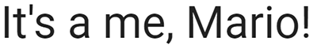
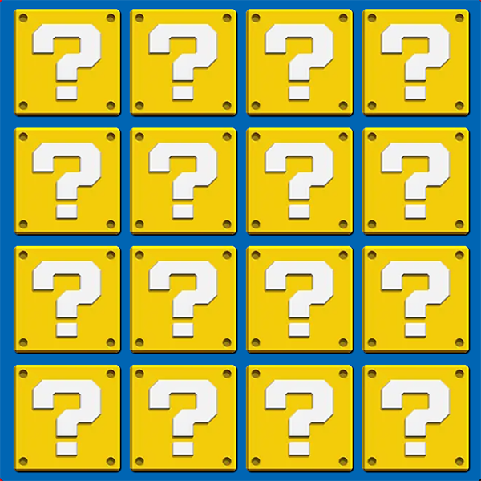

# Mario Memory

This is the website for Mario Memory; it is designed to be visually appealing, user-friendly, interactive, and accessible on all devices. It consists of a memory game that is themed around Mario.

[View live webpage](https://collingsandrew.github.io/milestone-two-project/index.html)

---

## User Experience (UX)

### Site Contents

- A Mario themed memory game.
- Instructions on how to play the game.
- A form that allows the user to contact the site owner.

### Target Audience

- Children.
- Young teenagers.
- Anyone with an interest in Mario.

### Project Purpose

The purpose of this project is to provide the user with a website on which they can take part in a fun memory game. It must have good design principles and provide significant interactive functionality.

### User Stories

#### Client Goals

1. I want the site to be simple to navigate and use.
2. I want to give the user the means of contacting the site owner.
3. I want the game to be intuitive and easy to understand, so that users of all ages can enjoy it.
4. I want the site to be accessible on multiple platforms (such as web, mobile, and tablets), so that users can play it on their preferred devices.
5. I want the site to have a visually appealing interface with good design principles and high-quality images, so that it attracts and engages users from the moment they visit.

#### User Goals

6. I want to take part in a fun game.
7. I want to read the instructions for the game.
8. I want to see how many cards I have matched so far.
9. I want to easily play again once the game is finished.
10. I want to see the game board with all the cards faced down initially so that I can begin the game.
11. I want to flip two cards at a time to match pairs so that I can progress through the game.
12. I want the cards to flip back if they don't match, so that I can try again.
13. I want the cards to stay flipped if they match.
14. I want the cards to be in a different position each game.
15. I want a timer to challenge myself to complete the game in the given time.
16. I want the option to restart the game.
17. I want visually appealing card designs and animations, so that the game is enjoyable to play.

## Accessibility

The site has been built with accessibility in mind to ensure that it is always a positive experience.

This has been achieved by:
- Semantic HTML.
- Choosing fonts and colours with high contrast.
- Adequate aria-labels for interactive features.
- Adequate alt attributes for images.

## Design

### Design Choices

The site has been designed to be consistent with the Mario theme; all images, colours and design choices have been made to make the user feel immersed in the world of Mario.

### Wireframes

Game Page

Modals

Contact Modal

404 Page

### Typography

The following Google Fonts were used on this site:

- Catamaran is used for the headings on the site.

- Roboto is used for the main text of the site.

Both of these fonts have been sourced from the [Official Mario Website](https://mario.nintendo.com/) to maintain a consistent theme.

### Colour Scheme

The color scheme across the site has been chosen to maintain a consistent theme. The red colour choice, inspired by the [Official Mario Website](https://mario.nintendo.com/), ensures coherence with the franchise. Likewise, the blue color has been matched to Mario's iconic apron, maintaining the consistent theme.

Red

Blue

## Features

- The site boasts a responsive design, ensuring accessibility across all device sizes.
- All images are of high quality and are chosen to align with the theme of the site.
- The design is simple, providing an immediate understanding of the site's purpose and the essence of the game.

User Stories: 3, 4, 5, 17

### Page Heading

- The moment the user enters the site, they are greeted by an image of Mario alongside the heading 'Mario Memory'.

User stories: 5

Preview

### Game Stats

- Displays a visible indicator showing the number of correct matches the user has made, allowing them to track their progress.
- Displays the remaining time until the end of the game, ensuring players can keep track of their progress.

User stories: 8, 15

Preview

### Game Board

- The game board consists of 16 cards, all with appealing designs adhering to the consistent theme.
- The cards are shuffled at the start of each game.
- The user can only flip two cards at a time.
- Unmatched cards are flipped back over.
- When two cards are matched, the cards remain flipped.
- High quality Mario themed images have been used for the card designs.

User stories: 5, 6, 10, 11, 12, 13, 16, 17

Preview Unflipped

Preview Flipped

### New Game

- Allows the user to start a new game.
- Shuffles the cards each time the 'New Game' button is clicked.

User Stories: 9, 14, 16

### How To Play Modal

- Displays a modal upon clicking the 'How To Play' button.
- Provides the user with the goal of the game and instructions on how to play.
- Close button that hides the modal.

User Stories: 3, 7

Preview

### Contact Us Modal

- Displays a modal upon clicking the 'Contact Us' button.
- Offers the user a form to complete, enabling communication with the site owner.
- Utilizes the emailjs API for transmitting completed forms to the site owner.
- Close button that hides the modal.

User Stories: 2

Preview

### Modals

- All modals follow the same consistent design and use high quality images.
- Alerts the user whether they have completed the game or that it is game over.
- Offers the user the option to play again.
- All cards shuffle when the user chooses to play again.

User Stories: 5, 9, 14, 16

Winning Modal

Game Over Modal

## Deployment

### Deploying the project

GitHub pages were used to deploy this project. The following steps explain how this is done:

1. When logged into GitHub, locate and access the [repository.](https://github.com/collingsandrew/milestone-two-project)
2. Click on the settings link that is located at the top of the repository.
3. Using the menu to the left, follow the pages link.
4. Here, we then need to make sure the source drop-down box is set to 'deploy from branch'.
5. Finally, we set the branch to 'main' and the folder to 'root', and then click save.

The page should then refresh, and the link to the deployed website should appear at the top of the page.

### Fork

Forking a project creates a completely separate codebase and allows a user to make local changes to a project without affecting the original repository itself.

To fork the repository:

1. When logged into GitHub, locate and access the [repository.](https://github.com/collingsandrew/milestone-two-project)
2. At the top right of the repository, there will be a 'fork' option.

### Clone

Cloning a project allows a user to make contributions to the main repository, with permission.

To clone the repository:

1. When logged into GitHub, locate and access the [repository.](https://github.com/collingsandrew/milestone-two-project)
2. Above your files to the right, select the code drop down button and select either HTTPS, SSH or GitHub CLI and then copy the URL below.
3. Then, in your chosen code editor, change the current working directory to the location you would like the cloned repository to be located.
4. In the terminal, type 'git clone' and paste the URL that you copied earlier, and then press enter.