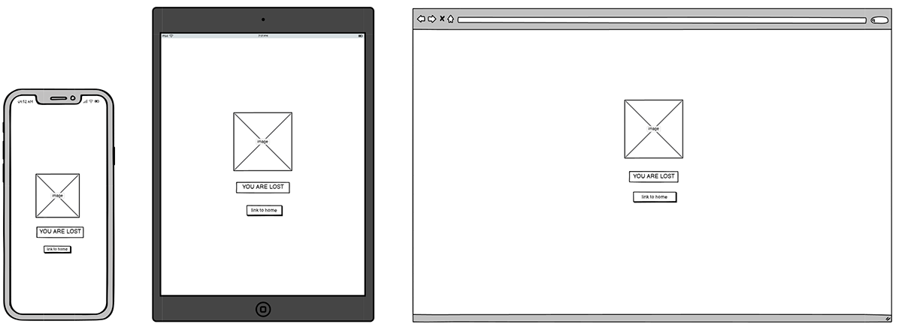

# Mario Memory

This is the website for Mario Memory; it is designed to be visually appealing, user-friendly, interactive, and accessible on all devices. It consists of a memory game that is themed around Mario.

[View live webpage](https://collingsandrew.github.io/milestone-two-project/index.html)

---

## User Experience (UX)

### Site Contents

- A Mario themed memory game.
- Instructions on how to play the game.
- A form that allows the user to contact the site owner.

### Target Audience

- Children.
- Young teenagers.
- Anyone with an interest in Mario.

### Project Purpose

The purpose of this project is to provide the user with a website on which they can take part in a fun memory game. It must have good design principles and provide significant interactive functionality.

### User Stories

#### Client Goals

1. I want the site to be simple to navigate and use.
2. I want to give the user the means of contacting the site owner.
3. I want the game to be intuitive and easy to understand, so that users of all ages can enjoy it.
4. I want the site to be accessible on multiple platforms (such as web, mobile, and tablets), so that users can play it on their preferred devices.
5. I want the site to have a visually appealing interface with good design principles and high-quality graphics, so that it attracts and engages users from the moment they visit.

#### User Goals

6. I want to take part in a fun game.
7. I want to read the instructions for the game.
8. I want to see how many cards I have matched so far.
9. I want to easily play again once the game is finished.
10. I want to see the game board with all the cards faced down initially so that I can begin the game.
11. I want to flip two cards at a time to match pairs so that I can progress through the game.
12. I want the cards to flip back if they don't match, so that I can try again.
13. I want the cards to stay flipped if they match.
14. I want a timer to challenge myself to complete the game in the given time.
15. I want the option to restart the game.
16. I want visually appealing card designs and animations, so that the game is enjoyable to play.

## Accessibility

The site has been built with accessibility in mind to ensure that it is always a positive experience.

This has been achieved by:
- Semantic HTML.
- Choosing fonts and colours with high contrast.
- Adequate aria-labels for interactive features.
- Adequate alt attributes for images.

## Design

### Design Choices

The site has been designed to be consistent with the Mario theme; all images, colours and design choices have been made to make the user feel immersed in the world of Mario.

### Wireframes

Game Page

Modals

Contact Modal

404 Page

